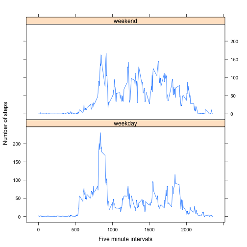

# Reproducible Research: Peer Assessment 1

```r
library(knitr)
```


## Loading and preprocessing the data

```r
# set the working directory
setwd("~/Desktop/DataScience_part2/reproducible research/RepData_PeerAssessment1")
# read the data
data <- read.csv("activity.csv", header = TRUE, sep = ",", na.strings = "NA")
# transforming the date variable to Date format
data$date <- as.Date(as.character(data$date), "%Y-%m-%d")
```


## What is mean total number of steps taken per day?

```r
# remove NA entries
data_clean <- data[!is.na(data$steps), ]
# to get total sum of steps for each date
stepData <- aggregate(steps ~ date, data = data_clean, FUN = sum)

# change the output display
options(scipen = 999)

# calculating the mean and median
mean <- round(mean(stepData$steps), 2)
median <- round(median(stepData$steps), 2)

# plotting the histogram as required
hist(stepData$steps, main = "Total no. of steps taken each day", xlab = "Steps per day")
```

 


The mean of number of steps is **10766.19** and Median is **10765.** 

## What is the average daily activity pattern?

```r
library(plyr)
average_date <- ddply(data_clean, .(interval), summarise, steps = mean(steps))
plot(average_date$interval, average_date$steps, type = "l", xlab = "5-minute interval", 
    ylab = "Average steps", main = "Average daily activity")
```

 

```r
Measurement <- average_date[average_date$steps == max(average_date$steps), ]
```


We observe from the data set that the **835** five minute interval contains the maximum number of steps **206.1698**


## Imputing missing values


```r

# calulating the total number of missing values in the dataset
missingCount <- sum(is.na(data$steps))
```


The total number of missing values in the dataset are: __2304__


```r
colnames(average_date)[2] <- "mean_steps"
merge_data <- arrange(join(data, average_date), interval)
```

```
## Joining by: interval
```

```r
merge_data$steps[is.na(merge_data$steps)] <- merge_data$mean_steps[is.na(merge_data$steps)]
# plot histogram
new_data <- ddply(merge_data, .(date), summarise, steps = sum(steps))
hist(new_data$steps, main = "Total no. of steps taken each day", xlab = "Steps per day")
```

 

```r

new_mean <- mean(new_data$steps)
new_median <- median(new_data$steps)
```


The new mean of number of steps is **10766.1887** and new Median is **10766.1887.** 
we can see that there is not much difference in the mean and median.

## Are there differences in activity patterns between weekdays and weekends?

```r
library(lattice)
weekdays <- weekdays(as.Date(merge_data$date))
merge_data$days <- weekdays
merge_data$label <- ifelse(merge_data$days %in% c("Saturday", "Sunday"), "weekend", 
    "weekday")
average_week <- ddply(merge_data, .(interval, label), summarise, steps = mean(steps))
xyplot(steps ~ interval | label, data = average_week, layout = c(1, 2), type = "l", 
    xlab = "Five minute intervals", ylab = "Number of steps")
```

 


From the plot, we can observe that there is a higher peak in the number of steps taken between the 500 to 1000 five minute intervals which is in the early morning on weekdays rather than weekends. 


